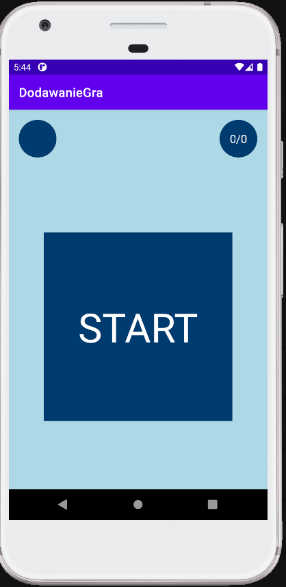

# DodawanieGra
Game of quick calculation of sum of two randomly generated numbers.

<h3>App features:</h3>

- User have 10 second to answer.
- If user selects correct answer tapped tile changes background color to green.
- If user selects incorrect answer tapped tile changes background color to red.
- When time elapses user is asked if he wants to play again.
- Correct and incorrect answers are counted.

<h3>Used technologies:</h3>

- random number generation,
- CountDownTimer.

<h3>App screenshots:</h3>

App start screen        |  Example of search screen
:-------------------------:|:-------------------------:
  |   

<h3>App during usage:</h3>

App start screen        |
:-------------------------:
  |  
